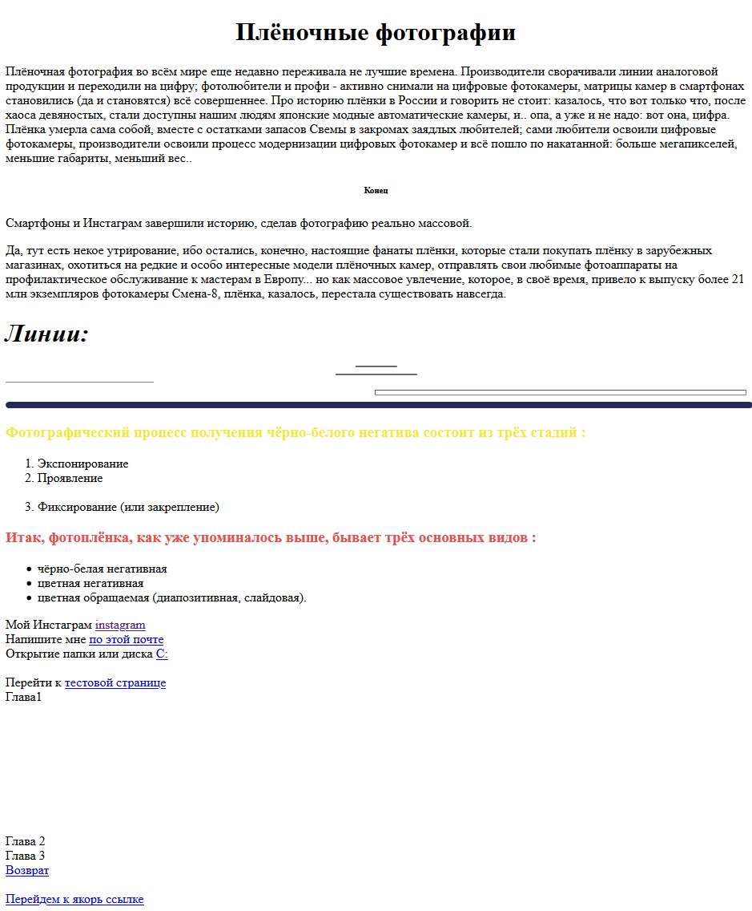
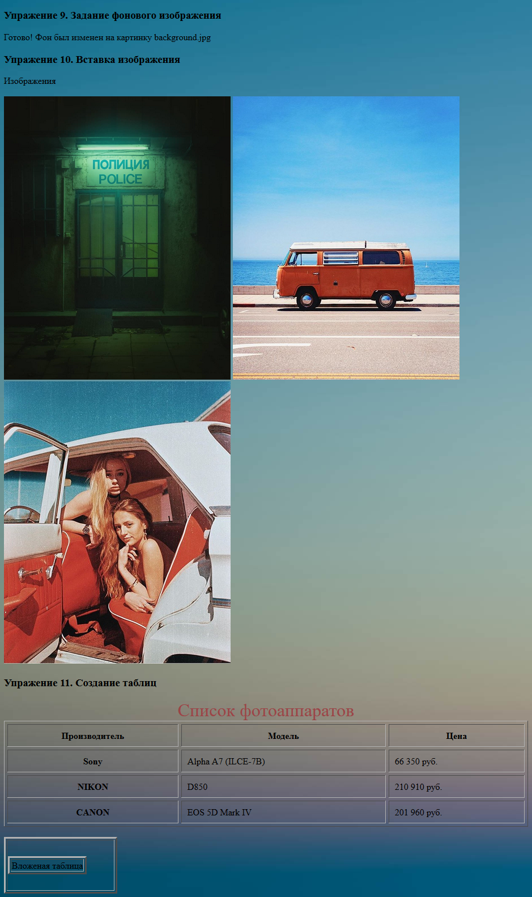
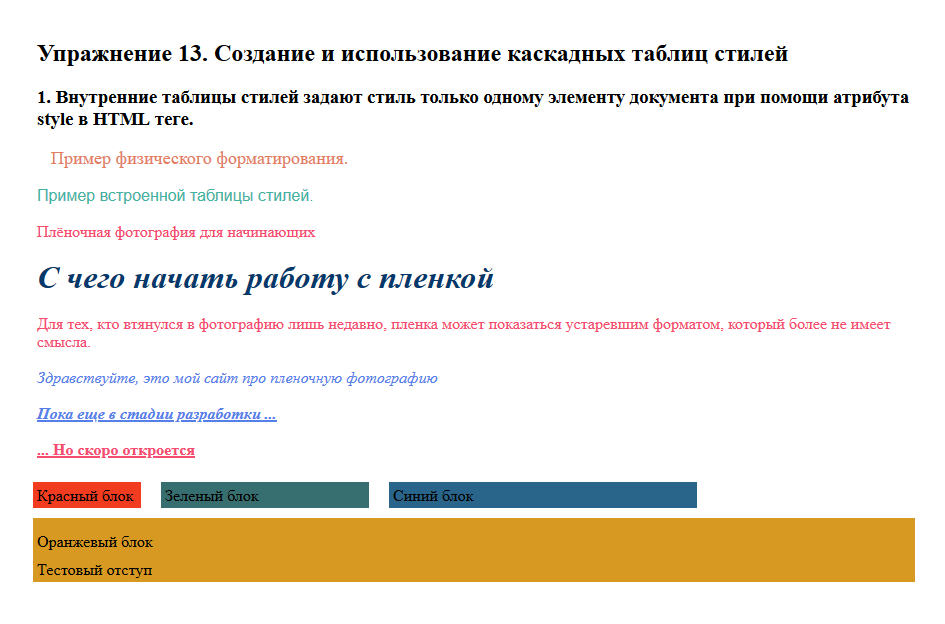

# Практические работы по предмету WEB программирование :new_moon_with_face:
 ____

## Статус практических работ

- [X] [Практическая работа 1](#практическая-работа-1-white_check_mark)
  - [X] [Упражнение 1. Изменеие строки заголовка](#упражнение-1-изменеие-строки-заголовка)
  - [X] [Упражнение 2. Использование заголовков в документе](#упражнение-2-использование-заголовков-в-документе)
  - [X] [Упражнение 3. Логическое форматирование текста на абзацы и отделение их друг от друга горизонтальными линиями.](#упражнение-3-логическое-форматирование-текста-на-абзацы-и-отделение-их-друг-от-друга-горизонтальными-линиями)
  - [X] [Упражнение 4. Использование упорядоченных и неупорядоченных списков](#упражнение-4-использование-упорядоченных-и-неупорядоченных-спискове)
  - [X] [Упражнение 5. Использование внешних гиперссылок](#упражнение-5-использование-внешних-гиперссылок)
  - [X] [Упражнение 6. Использование внутренних гиперссылок](#упражнение-6-использование-внутренних-гиперссылок)
  - [X] [Упражнение 7. Использование ссылок в одном документе](#упражнение-7-использование-ссылок-в-одном-документе)
  - [X] [Упражнение 8. Создание файла для возврата к определенному месту документа (якорю)](#упражнение-8-создание-файла-для-возврата-к-определенному-месту-документа-якорю)
- [X] [Практическая работа 2](#практическая-работа-2-white_check_mark)
  - [X] [Упражнение 9. Задание фонового изображения](#упражнение-9-задание-фонового-изображения)
  - [X] [Упражнение 10. Вставка изображений](#упражнение-10-вставка-изображений)
  - [X] [Упражнение 11. Создания таблицы](#упражнение-11-создания-таблицы)
  - [X] [Упражнение 12. Создание вложенных таблиц](#упражнение-12-создание-вложенных-таблиц)
- [X] Практическая работа 3
  - [X] Упражнение 13. Создание и использование каскадных таблиц стилей
  - [X] Упражнение 14. Использование классов в создании каскадных таблиц стилей
  - [X] Упражнение 15. Использование блочной верстки
  - [X] Упражнение 15. Использование блочной верстки
- [ ] Практическая работа 4
  - [ ] Упражнение 16. Текстовое поле и поле для ввода пароля
  - [ ] Упражнение 17. Текстовая область
  - [ ] Упражнение 18. Работа с флажком
  - [ ] Упражнение 19. Работа с переключателями
  - [ ] Упражнение 20. Работа со списками

Финальный сайт будет размещен в отдельном репозитории, ссылка на него: `(пока репозиторий не готов)` 
____

## Практическая работа 1 :white_check_mark: 

#### Код практической работы:

#####  Упражнение 1. Изменеие строки заголовка
```html
    <title>Плёночные фотографии</title>
```
#####  Упражнение 2. Использование заголовков в документе
```html
    <h1 align=center> Плёночные фотографии </h1>
    <p>Плёночная фотография во всём мире еще недавно переживала не лучшие времена. Производители сворачивали линии аналоговой продукции и переходили на цифру; фотолюбители и профи - активно снимали на цифровые фотокамеры, матрицы камер в смартфонах становились (да и становятся) всё совершеннее. Про историю плёнки в России и говорить не стоит: казалось, что вот только что, после хаоса девяностых, стали доступны нашим людям японские модные автоматические камеры, и.. опа, а уже и не надо: вот она, цифра. Плёнка умерла сама собой, вместе с остатками запасов Свемы в закромах заядлых любителей; сами любители освоили цифровые фотокамеры, производители освоили процесс модернизации цифровых фотокамер и всё пошло по накатанной: больше мегапикселей, меньшие габариты, меньший вес..</p>
    <h6 align=center>Конец</h6>
```

#####  Упражнение 3. Логическое форматирование текста на абзацы и отделение их друг от друга горизонтальными линиями.
```html
    Смартфоны и Инстаграм завершили историю, сделав фотографию реально массовой. <br>
    <p>Да, тут есть некое утрирование, ибо остались, конечно, настоящие фанаты плёнки, которые стали покупать плёнку в зарубежных магазинах, охотиться на редкие и особо интересные модели плёночных камер, отправлять свои любимые фотоаппараты на профилактическое обслуживание к мастерам в Европу... но как массовое увлечение, которое, в своё время, привело к выпуску более 21 млн экземпляров фотокамеры Смена-8, плёнка, казалось, перестала существовать навсегда. </p>

    <h1><i>Линии:</i></h1>
    <hr width="50">
    <hr width="100">
    <hr width= 20% align="left" size="1" >
    <hr width= 50% align="right" size="5" >
    <hr width= 100% align="center" size="8" color="#26295a" noshade>
```
#####  Упражнение 4. Использование упорядоченных и неупорядоченных спискове
```html
    <h3><font color="f3e737">Фотографический процесс получения чёрно-белого негатива состоит из трёх стадий :</font></h2>
    <ol start="1" type="1">
        <li>Экспонирование</li>
        <li>Проявление</li>
        <br>
        <li>Фиксирование (или закрепление)</li>
    </ol>

    <h3><font color="e4524f">Итак, фотоплёнка, как уже упоминалось выше, бывает трёх основных видов : </font></h3>
    <ul>
        <li>чёрно-белая негативная</li>
        <li>цветная негативная</li>
        <li>цветная обращаемая (диапозитивная, слайдовая).</li>
    </ul>
```
#####  Упражнение 5. Использование внешних гиперссылок
```html
    Мой Инстаграм <a href="https://www.instagram.com/pnchi_kun/">instagram</a>
    <br>
    Напишите мне <a href="mailto:romanbos14@gmail.com">по этой почте</a>
    <br>
    Открытие папки или диска <a href="C:\"> C: </a> 
```

#####  Упражнение 6. Использование внутренних гиперссылок
```html
    Перейти к <a href="test.html">тестовой странице</a> 
```
#####  Упражнение 7. Использование ссылок в одном документе
```html
    
    <br>
    <a name="Chapt1">Глава1</a>
    <br>
    <br>
    <br>
    <br>
    <br>
    <br>
    <br>
    <br>
    <br>
    <br>
    Глава 2
    <br>
    Глава 3
    <br>
    <a href="#Chapt1">Возврат</a>
```
#####  Упражнение 8. Создание файла для возврата к определенному месту документа (якорю)
```html
    <a href="test.html#Yakor">Перейдем к якорь ссылке</a>
```

#### Вид HTML страницы: 



____

## Практическая работа 2 :white_check_mark: 

#### Код практической работы:

#####  Упражнение 9. Задание фонового изображения
```html
    <body background="background.jpg">
```

#####  Упражнение 10. Вставка изображений
```html
    Изображения <br>
    <br>
    
    
    
```
#####  Упражнение 11. Создания таблицы
```html
    <table cellspacing="5" cellpadding="10" border="1" width="100%">
        <caption align="top" style="color:#9b4447; font-size: 32px" >Список фотоаппаратов</caption>
        <tr>
            <th>Производитель</th>
            <th>Модель</th>
            <th>Цена</th>
        </tr>
        <tr>
            <th> Sony</th>
            <td> Alpha A7 (ILCE-7B)</td>
            <td>  66 350 руб.</td>
        </tr>
        <tr>
            <th> NIKON</th>
            <td> D850</td>
            <td> 210 910 руб.</td>
        </tr>
        <tr>
            <th> CANON</th>
            <td> EOS 5D Mark IV</td>
            <td>  201 960 руб.</td>
        </tr>

    </table>
```

#####  Упражнение 12. Создание вложенных таблиц
```html
    <table border =3 width=200 height=100>
        <tr>
        <td>
        <table border =3>
        <tr>
        <td>Вложеная таблица</td>
        </tr>
        </table>
        </td>
        </tr>
        </table>
```
#### Вид HTML страницы: 



____

## Практическая работа 3 :white_check_mark: 

#### Код практической работы:

#####  Упражнение 13. Создание и использование каскадных таблиц стилей

1. Внутренние таблицы стилей задают стиль только одному элементу документа при помощи атрибута style в HTML теге.
```html
    <p><font color="#E27D60 " size="4" face="Arial”" >Пример физического форматирования.</font></p>
    <p style="color: #41B3A3; font-size:12pt; font-family:Arial"> Пример встроенной таблицы стилей.</p>
```
2. Глобальные стили (внедренные таблицы) задают вид элементов всего документа. Для этого используется тег `<style type="text/css">`. Он размещается в заголовке документа.
```html
    <style type="text/css">
        h1{color:#05386B; font-style: italic; font-size: 32px;}
        p{color: #F64C72}
    </style>
```
3. Использование внешних стилевых таблиц — самый экономный и обобщающий способ задания правил оформления однотипных элементов для любого количества страниц. То есть одну таблицу стилей можно использовать для форматирования многих страниц, что приводит к единообразному отображению различных документов и придает некоторую системность серверу разработчика. Осуществляется связывание отдельного файла, содержащего стилевые правила, с множеством гипертекстовых документов. Связываемый файл содержит набор правил.

Файл example_styles.css
```css
    body{
    background-color: #EAE7DC;
    font-size: 14pt;
    color: #D8C3A5;
    font-family: Arial, Helvetica, sans-serif;
    }

    h1, p {
        color: #E98074;
    }
```
Файл example_styles.html 
```html
   <!DOCTYPE html>
<html lang="en">
<head>
    <meta charset="UTF-8">
    <meta name="viewport" content="width=device-width, initial-scale=1.0">
    <link rel="stylesheet" type="text/css" href="example_styles.css">
    <title>Пример использования внешного файла</title>
</head>
<body>
    Пример внешней таблицы стилей
    <h1> Пленка и «цифра» </h1>
    <p> Хотя выбор между пленочной и цифровой камерой всегда остается за фотографом, в пленочной фотографии есть несколько фундаментальных элементов, которые я считаю серьезными преимуществами ее перед цифровой</p>
</body>
</html>
```

#####  Упражнение 14. Использование классов в создании каскадных таблиц стилей
```css
        .blue{
            color:#5680E9;
            font-style: italic;
        }
        #boldunderline {
            text-decoration: underline;
            font-weight: bold;
        }
```
#####  Упражнение 15. Использование блочной верстки
```html
    <div style="background:#F13C20; width: 100px; float: left;">Красный блок</div>
    <div style="background:#376E6F; width: 200px; float: left;">Зеленый блок</div>
    <div style="background:#29648A; width: 300px; float: left;">Синий блок</div>
    <div style="background:#D79922; clear: left;">Оранжевый блок <br> Тестовый отступ</div>
```

#### Вид HTML страницы: 

